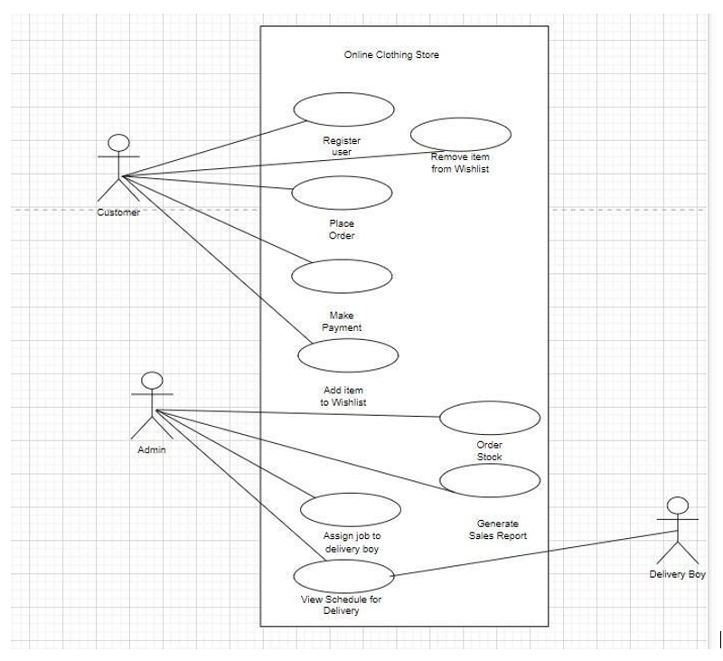
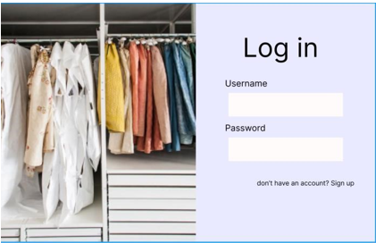
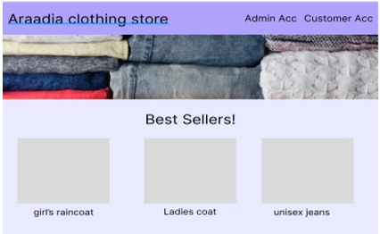
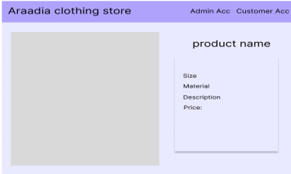
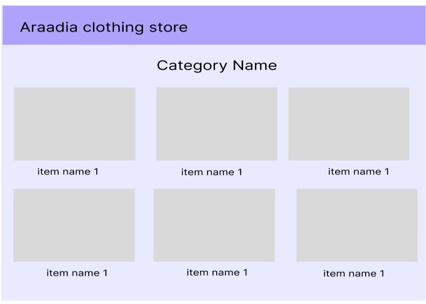
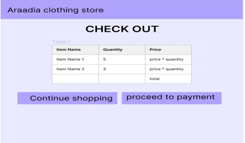

# Araadia Clothing Store 👗👠🛍️

**Team Members:** 🚀
- Maria Saeed Ahmed 
- Areeba Sattar 
- Saad Khan 

## Overview 🌟

Welcome to the Araadia Clothing Store project repository! 🛍️ This repository documents functional and non-functional requirements, use cases, user stories, and sprints for developing an online clothing store system. Araadia Clothing Store aims to provide an efficient and user-friendly platform for users to shop their favorite clothing items.

## Functional Requirements 🛒

1. **User Registration and Login:** Allow users to create accounts and log in to access the online store.
2. **Product Catalog:** Manage items available for sale.
3. **Shopping Cart:** Enable users to add items, view the cart, and proceed to checkout.
4. **Payment Processing:** Secure online payments integration.
5. **Wish List:** Allow users to maintain a wish list.
6. **Inventory Management:** Admins manage stock and availability.
7. **Payment Services Integration:** Seamless transaction processing.

## Non-Functional Requirements 📈

1. **Performance:** Fast response, minimal downtime.
2. **Reliability:** Backup plans for system reliability.
3. **Security:** Robust measures for data protection.
4. **Scalability:** Easily scalable design.
5. **Usability:** Intuitive user experience.

## Use Cases 📋

### Use Case Diagram 🌐

### Use Case Descriptions 📝

1. **Register User:** New users can create accounts.
2. **Order Stock:** Admins order new stock.
3. **Place Order:** Customers select items, provide info, pay, and place orders.
4. **Make Payment:** Customers pay securely.
5. **Generate Sales Report:** Admins analyze sales trends.
6. **Add Item to Wish List:** Users maintain a wish list.
7. **Remove Item from Wish List:** Users adjust wish lists.
8. **Assign Job to Delivery Boy:** Admins assign delivery tasks.
9. **View Schedule for Delivery (Delivery Boy/Admin):** Delivery staff/admins view delivery schedules.
10. **Customer/Admin Login:** Log in with roles.
11. **Manage Items:** Admins manage items.

## User Stories 📖

### User Stories for Selected Use Cases ✨

1. **Register User:**
   - New user registers for an account.

2. **Place Order:**
   - Customer places an order for products.

3. **Generate Sales Report:**
   - Admin generates sales reports.

## Sprint Backlog 🚀

### 1st Sprint 🏃‍♀️🏃‍♂️

#### User Story: Register User
- Create registration form
- Implement validation
- Store registration data

#### User Story: Order Stock
- Place and confirm supplier orders
- Update inventory after delivery

### 2nd Sprint 🏃‍♀️🏃‍♂️

#### User Story: Add Item to Wish List
- Implement product search
- Design product detail pages
- Enable "Add to Wish List" functionality

#### User Story: Remove Item from Wish List
- Implement wish list search and removal

#### User Story: View Schedule for Delivery (Admin)
- Design admin view for delivery schedules
- Create delivery schedules database
- Display schedules on the page

### 3rd Sprint 🏃‍♀️🏃‍♂️

#### User Story: Place Order
- Design order placement page
- Integrate order placement with payment
- Update inventory

#### User Story: Make Payment
- Design payment UI
- Implement "Make Payment" functionality
- Update inventory

#### User Story: Generate Sales Report
- Design sales report display
- Retrieve and display sales data

## Prototyping 🎨

Let's shop with style! 💃👠👜🛍️👗
